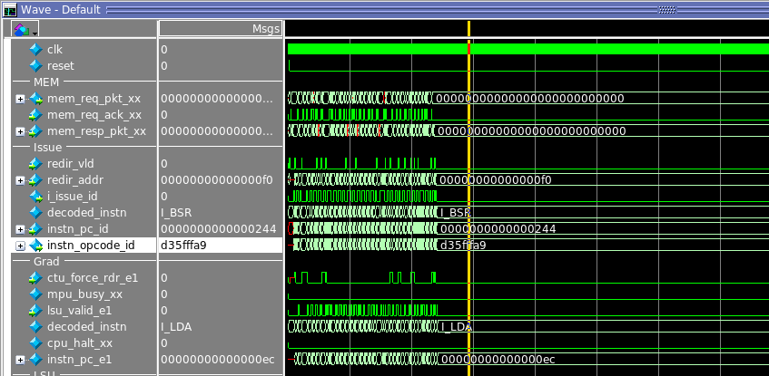
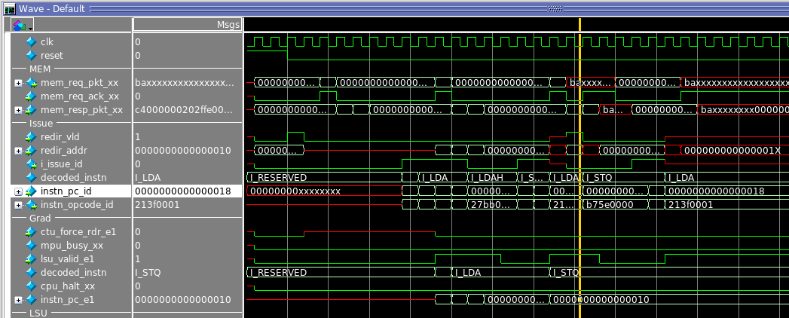

## Works Ok

- 00_sanity program in Modelsim
- 01_gpio program in Modelsim & on Terasic DE10_Lite

## Known Problems
 
1. При запуске в Modelsim симуляции примера 02_uart (-O0) присходит зависание на PC=224 (issue)
```
 230:	00 00 21 28 	ldbu	t0,0(t0)
 234:	01 00 e1 73 	sextb	t0,t0
 238:	01 f0 3f 44 	and	t0,0xff,t0
 23c:	10 04 e1 47 	mov	t0,a0
 240:	00 00 fe 2f 	unop	
 244:	a9 ff 5f d3 	bsr	ra,ec <uartTransmit>
 248:	00 00 fe 2f 	unop	
 24c:	00 00 fe 2f 	unop	
 250:	10 00 2f a4 	ldq	t0,16(fp)
 254:	00 00 21 28 	ldbu	t0,0(t0)
 258:	01 00 e1 73 	sextb	t0,t0
```



2. При запуске в Modelsim симуляции примера 02_uart (-Os) команда на PC=18 (issue) вызывет X на транзакции запроса к памяти (mem_req_pkt_xx)
```
0000000000000000 <main>:
   0:	01 00 bb 27 	ldah	gp,1(t12)
   4:	00 90 bd 23 	lda	gp,-28672(gp)
   8:	f0 ff de 23 	lda	sp,-16(sp)
   c:	01 00 1f 22 	lda	a0,1
  10:	00 00 5e b7 	stq	ra,0(sp)
  14:	08 00 3e b5 	stq	s0,8(sp)
  18:	01 00 3f 21 	lda	s0,1
  1c:	00 00 fe 2f 	unop	
  20:	16 00 40 d3 	bsr	ra,7c <uartInit>
```



3. При запуске 00_sanity внутри gem5 симулятор падает на тестах доступа к uncached памяти

Лог запуска gem5:
```
 252000: system.cpu T0 : @stb_mask+116    : lda        r21,1(r31)      : IntAlu :  D=0x0000000000000001
 252500: system.cpu T0 : @stb_mask+120    : sll        r21,63,r21      : IntAlu :  D=0x8000000000000000
 253000: system.cpu T0 : @stb_mask+124    : bis        r21,r20,r20     : IntAlu :  D=0x8000000000000594
 253500: system.cpu T0 : @stb_mask+128    : bic        r20,7,r20       : IntAlu :  D=0x8000000000000590
 254000: system.cpu T0 : @stb_mask+132    : ldq        r22,0(r20)      : MemRead :  A=0x8000000000000590
panic: fault (dtb_page_fault) detected @ PC (0x6cc=>0x6d0)
Memory Usage: 763680 KBytes
Program aborted at tick 254000
--- BEGIN LIBC BACKTRACE ---
/home/zsl/work/projects/cpu_perf_tests/dec_alpha/alpha/build/gem5/build/ALPHA/gem5.opt(_Z15print_backtracev+0x15)[0xd95955]
/home/zsl/work/projects/cpu_perf_tests/dec_alpha/alpha/build/gem5/build/ALPHA/gem5.opt(_Z12abortHandleri+0x36)[0xd9ecf6]
/lib64/libpthread.so.0(+0xf5d0)[0x7f9da79675d0]
/lib64/libc.so.6(gsignal+0x37)[0x7f9da61b1207]
/lib64/libc.so.6(abort+0x148)[0x7f9da61b28f8]
/home/zsl/work/projects/cpu_perf_tests/dec_alpha/alpha/build/gem5/build/ALPHA/gem5.opt[0x5f5aff]
/home/zsl/work/projects/cpu_perf_tests/dec_alpha/alpha/build/gem5/build/ALPHA/gem5.opt(_ZN9FaultBase6invokeEP13ThreadContextRK14RefCountingPtrI10StaticInstE+0x346)[0xdb96c6]
/home/zsl/work/projects/cpu_perf_tests/dec_alpha/alpha/build/gem5/build/ALPHA/gem5.opt(_ZN8AlphaISA10AlphaFault6invokeEP13ThreadContextRK14RefCountingPtrI10StaticInstE+0x18)[0x880968]
/home/zsl/work/projects/cpu_perf_tests/dec_alpha/alpha/build/gem5/build/ALPHA/gem5.opt(_ZN13BaseSimpleCPU9advancePCERKSt10shared_ptrI9FaultBaseE+0xcb)[0x934f6b]
/home/zsl/work/projects/cpu_perf_tests/dec_alpha/alpha/build/gem5/build/ALPHA/gem5.opt(_ZN15AtomicSimpleCPU4tickEv+0x4bc)[0x92c81c]
/home/zsl/work/projects/cpu_perf_tests/dec_alpha/alpha/build/gem5/build/ALPHA/gem5.opt(_ZN10EventQueue10serviceOneEv+0xa1)[0xd9ada1]
/home/zsl/work/projects/cpu_perf_tests/dec_alpha/alpha/build/gem5/build/ALPHA/gem5.opt(_Z9doSimLoopP10EventQueue+0x38)[0xda9b48]
/home/zsl/work/projects/cpu_perf_tests/dec_alpha/alpha/build/gem5/build/ALPHA/gem5.opt(_Z8simulatem+0xaae)[0xdaa97e]
/home/zsl/work/projects/cpu_perf_tests/dec_alpha/alpha/build/gem5/build/ALPHA/gem5.opt[0x90f5e0]
/home/zsl/work/projects/cpu_perf_tests/dec_alpha/alpha/build/gem5/build/ALPHA/gem5.opt[0x8f271a]
/lib64/libpython2.7.so.1.0(PyEval_EvalFrameEx+0x730a)[0x7f9da726a20a]
/lib64/libpython2.7.so.1.0(PyEval_EvalCodeEx+0x7ed)[0x7f9da726c03d]
/lib64/libpython2.7.so.1.0(PyEval_EvalFrameEx+0x663c)[0x7f9da726953c]
/lib64/libpython2.7.so.1.0(PyEval_EvalCodeEx+0x7ed)[0x7f9da726c03d]
/lib64/libpython2.7.so.1.0(PyEval_EvalFrameEx+0x663c)[0x7f9da726953c]
/lib64/libpython2.7.so.1.0(PyEval_EvalCodeEx+0x7ed)[0x7f9da726c03d]
/lib64/libpython2.7.so.1.0(PyEval_EvalFrameEx+0x663c)[0x7f9da726953c]
/lib64/libpython2.7.so.1.0(PyEval_EvalCodeEx+0x7ed)[0x7f9da726c03d]
/lib64/libpython2.7.so.1.0(PyEval_EvalCode+0x32)[0x7f9da726c142]
/lib64/libpython2.7.so.1.0(PyEval_EvalFrameEx+0x5513)[0x7f9da7268413]
/lib64/libpython2.7.so.1.0(PyEval_EvalCodeEx+0x7ed)[0x7f9da726c03d]
/lib64/libpython2.7.so.1.0(PyEval_EvalFrameEx+0x663c)[0x7f9da726953c]
/lib64/libpython2.7.so.1.0(PyEval_EvalCodeEx+0x7ed)[0x7f9da726c03d]
/lib64/libpython2.7.so.1.0(PyEval_EvalCode+0x32)[0x7f9da726c142]
/lib64/libpython2.7.so.1.0(+0x10057f)[0x7f9da728557f]
/lib64/libpython2.7.so.1.0(PyRun_StringFlags+0x65)[0x7f9da72863e5]
/home/zsl/work/projects/cpu_perf_tests/dec_alpha/alpha/build/gem5/build/ALPHA/gem5.opt(_Z6m5MainiPPc+0x5f)[0xd9db1f]
--- END LIBC BACKTRACE ---
make: *** [gem5_run] Aborted (core dumped)
```

Участок на котором происходит падение PC (0x6cc=>0x6d0):

```
 6c0:	35 f7 a7 4a 	sll	a5,0x3f,a5
 6c4:	14 04 b4 46 	or	a5,a4,a4
 6c8:	14 f1 80 46 	andnot	a4,0x7,a4
 6cc:	00 00 d4 a6 	ldq	t8,0(a4)
 6d0:	04 00 d4 a2 	ldl	t8,4(a4)
 6d4:	06 00 d4 32 	ldwu	t8,6(a4)
 6d8:	36 00 f6 73 	sextw	t8,t8
 6dc:	07 00 d4 2a 	ldbu	t8,7(a4)
 6e0:	16 00 f6 73 	sextb	t8,t8
 6e4:	01 00 39 23 	lda	t11,1(t11)
 6e8:	20 80 9d a6 	ldq	a4,-32736(gp)
 6ec:	01 00 bf 22 	lda	a5,1
 6f0:	35 f7 a7 4a 	sll	a5,0x3f,a5
 6f4:	15 04 b4 46 	or	a5,a4,a5
 6f8:	00 00 15 b5 	stq	t7,0(a5)
 6fc:	04 00 15 b1 	stl	t7,4(a5)
 700:	06 00 15 35 	stw	t7,6(a5)
 704:	07 00 15 39 	stb	t7,7(a5)
 708:	00 00 d4 a6 	ldq	t8,0(a4)
 70c:	1f 04 ff 47 	nop	
 710:	1f 04 ff 47 	nop	
```

Исходный код:

```
 #uncached
   lda   $r25, 1($r25)  # TEST 17
   lda   $r20, __test_16_jsr_mark0
   lda   $r21, 1
   sll   $r21, 63
   or    $r21, $r20, $r20
   bic   $r20, 7
   ldq   $r22, 0($r20)
   ldl   $r22, 4($r20)
   ldw   $r22, 6($r20)
   ldb   $r22, 7($r20)

   lda   $r25, 1($r25)  # TEST 18
   lda   $r20, _mydata
   lda   $r21, 1
   sll   $r21, 63
   or    $r21, $r20, $r21
   stq   $r8,  0($r21)
   stl   $r8,  4($r21)
   stw   $r8,  6($r21)
   stb   $r8,  7($r21)
   ldq   $r22, 0($r20)

   nop
   nop
```

4. При запуске dhry внутри gem5 симулятор падает при обращении к памяти:

```
 400500: system.cpu T0 : @Proc_1+56    : ldq        r4,24(r1)       : MemRead :  D=0x00000000000000e8 A=0x18
 401000: system.cpu T0 : @Proc_1+60    : ldq        r3,32(r1)       : MemRead :  D=0x0000000000000040 A=0x20
 401500: system.cpu T0 : @Proc_1+64    : ldq        r2,40(r1)       : MemRead :  D=0x0000000000002600 A=0x28
 402000: system.cpu T0 : @Proc_1+68    : ldq        r1,48(r1)       : MemRead :  D=0x0038004000000000 A=0x30
 402500: system.cpu T0 : @Proc_1+72    : stq        r7,0(r9)        : MemWrite :  D=0xfffffffff920d000 A=0xfffffffff920d000
panic: panic condition !pte occurred: Tried to access unmapped address 0xfffffffff920d000.
Memory Usage: 763620 KBytes
Program aborted at tick 402500
--- BEGIN LIBC BACKTRACE ---
/home/zsl/work/projects/cpu_perf_tests/dec_alpha/alpha/build/gem5/build/ALPHA/gem5.opt(_Z15print_backtracev+0x15)[0xd95955]
/home/zsl/work/projects/cpu_perf_tests/dec_alpha/alpha/build/gem5/build/ALPHA/gem5.opt(_Z12abortHandleri+0x36)[0xd9ecf6]
/lib64/libpthread.so.0(+0xf5d0)[0x7f25d84005d0]
/lib64/libc.so.6(gsignal+0x37)[0x7f25d6c4a207]
/lib64/libc.so.6(abort+0x148)[0x7f25d6c4b8f8]
/home/zsl/work/projects/cpu_perf_tests/dec_alpha/alpha/build/gem5/build/ALPHA/gem5.opt[0x5f5aff]
/home/zsl/work/projects/cpu_perf_tests/dec_alpha/alpha/build/gem5/build/ALPHA/gem5.opt(_ZN8AlphaISA13NDtbMissFault6invokeEP13ThreadContextRK14RefCountingPtrI10StaticInstE+0x1f8)[0x881088]
/home/zsl/work/projects/cpu_perf_tests/dec_alpha/alpha/build/gem5/build/ALPHA/gem5.opt(_ZN13BaseSimpleCPU9advancePCERKSt10shared_ptrI9FaultBaseE+0xcb)[0x934f6b]
/home/zsl/work/projects/cpu_perf_tests/dec_alpha/alpha/build/gem5/build/ALPHA/gem5.opt(_ZN15AtomicSimpleCPU4tickEv+0x4bc)[0x92c81c]
/home/zsl/work/projects/cpu_perf_tests/dec_alpha/alpha/build/gem5/build/ALPHA/gem5.opt(_ZN10EventQueue10serviceOneEv+0xa1)[0xd9ada1]
/home/zsl/work/projects/cpu_perf_tests/dec_alpha/alpha/build/gem5/build/ALPHA/gem5.opt(_Z9doSimLoopP10EventQueue+0x38)[0xda9b48]
/home/zsl/work/projects/cpu_perf_tests/dec_alpha/alpha/build/gem5/build/ALPHA/gem5.opt(_Z8simulatem+0xaae)[0xdaa97e]
/home/zsl/work/projects/cpu_perf_tests/dec_alpha/alpha/build/gem5/build/ALPHA/gem5.opt[0x90f5e0]
/home/zsl/work/projects/cpu_perf_tests/dec_alpha/alpha/build/gem5/build/ALPHA/gem5.opt[0x8f271a]
/lib64/libpython2.7.so.1.0(PyEval_EvalFrameEx+0x730a)[0x7f25d7d0320a]
/lib64/libpython2.7.so.1.0(PyEval_EvalCodeEx+0x7ed)[0x7f25d7d0503d]
/lib64/libpython2.7.so.1.0(PyEval_EvalFrameEx+0x663c)[0x7f25d7d0253c]
/lib64/libpython2.7.so.1.0(PyEval_EvalCodeEx+0x7ed)[0x7f25d7d0503d]
/lib64/libpython2.7.so.1.0(PyEval_EvalFrameEx+0x663c)[0x7f25d7d0253c]
/lib64/libpython2.7.so.1.0(PyEval_EvalCodeEx+0x7ed)[0x7f25d7d0503d]
/lib64/libpython2.7.so.1.0(PyEval_EvalFrameEx+0x663c)[0x7f25d7d0253c]
/lib64/libpython2.7.so.1.0(PyEval_EvalCodeEx+0x7ed)[0x7f25d7d0503d]
/lib64/libpython2.7.so.1.0(PyEval_EvalCode+0x32)[0x7f25d7d05142]
/lib64/libpython2.7.so.1.0(PyEval_EvalFrameEx+0x5513)[0x7f25d7d01413]
/lib64/libpython2.7.so.1.0(PyEval_EvalCodeEx+0x7ed)[0x7f25d7d0503d]
/lib64/libpython2.7.so.1.0(PyEval_EvalFrameEx+0x663c)[0x7f25d7d0253c]
/lib64/libpython2.7.so.1.0(PyEval_EvalCodeEx+0x7ed)[0x7f25d7d0503d]
/lib64/libpython2.7.so.1.0(PyEval_EvalCode+0x32)[0x7f25d7d05142]
/lib64/libpython2.7.so.1.0(+0x10057f)[0x7f25d7d1e57f]
/lib64/libpython2.7.so.1.0(PyRun_StringFlags+0x65)[0x7f25d7d1f3e5]
/home/zsl/work/projects/cpu_perf_tests/dec_alpha/alpha/build/gem5/build/ALPHA/gem5.opt(_Z6m5MainiPPc+0x5f)[0xd9db1f]
/home/zsl/work/projects/cpu_perf_tests/dec_alpha/alpha/build/gem5/build/ALPHA/gem5.opt(main+0x38)[0x5cd9a8]
--- END LIBC BACKTRACE ---
make: *** [gem5_run] Aborted (core dumped)
```

5. Сформированный компилятором HEX-файл для примера dhry существенно отличается от hex-файла идущего с проектом. Точка входа в программу смещена от вектора сброса процессора. При запуске в Modelsim это приводит к ошибкам. В связи с зависаниями процессора на программе 02_uart и невозможности обеспечить вывод информации на uart адаптация/отладка dhrystone не производилась

6. Не совсем ясно, как отключить LINE (кэшируемый?) доступ к памяти устройства (uart, 0x80002000), где лишнее чтение из регистра может вызвать потерю данных. В программе предполгается только побайтовое чтение, по факту ядро запрашивает LINE:
```
# [ 1730000ps] REQ  <STORE> BYTE @80002003 00000000_00000003
# [ 1730000ps] RESP <FETCH> LINE @00000058 28420000_20422003
# [ 1750000ps] 00000000_0000004c: <   I_LDA> 00000000_80002003 --> $t0 (r 1)
# [ 1750000ps] RESP <STORE> BYTE @80002003 00000000_00000000
# [ 1830000ps] 00000000_00000050: <   I_LDA> 00000000_00000001 --> $t1 (r 2)
# [ 1830000ps] REQ  <FETCH> LINE @00000060 00000000_00000000
# [ 1850000ps] 00000000_00000054: <   I_SLL> 00000000_80000000 --> $t1 (r 2)
# [ 1850000ps] RESP <FETCH> LINE @00000060 444ff502_445ff002
# [ 1870000ps] 00000000_00000058: <   I_LDA> 00000000_80002003 --> $t1 (r 2)
# [ 1870000ps] RESP <FETCH> LINE @00000068 38410000_445ff002
# [ 1910000ps] REQ  < LOAD> LINE @80002000 00000000_80002003
# [ 1930000ps] RESP < LOAD> LINE @80002000 xxxxxxxx_xxxxxxxx
# [ 1950000ps] RESP < LOAD> LINE @80002008 xxxxxxxx_xxxxxxxx
```
